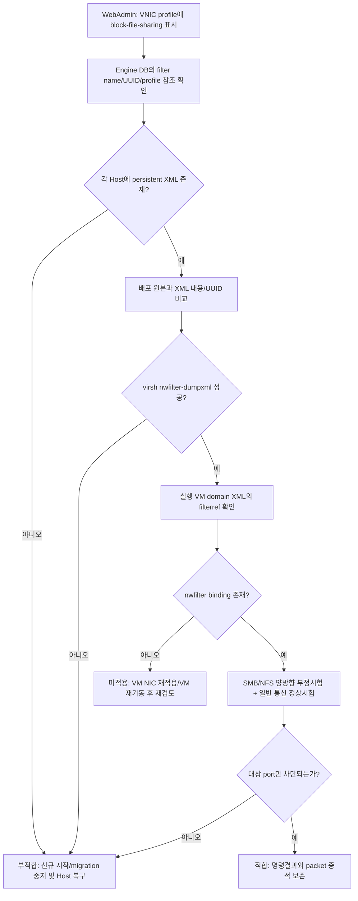

# `block-file-sharing` 네트워크 필터 검토·복구 절차

## 1. 결론

WebAdmin의 VNIC profile에 `block-file-sharing`이 표시되더라도 Host의 `/etc/libvirt/nwfilter/block-file-sharing.xml`이 없으면 **필터 적용 의도만 확인된 상태**이다. 이 화면만으로 SMB/NFS 차단이 동작한다고 판정해서는 안 된다.

검토는 다음 네 계층을 모두 통과해야 한다.

1. **Engine DB:** VNIC profile이 올바른 network filter ID를 참조한다.
2. **Host libvirt 정의:** 각 실행 가능 Host에 persistent XML이 있고 libvirt가 filter를 조회할 수 있다.
3. **VM 연결:** 실행 VM의 실제 interface/filter binding이 `block-file-sharing`을 참조한다.
4. **효과성:** 허용 traffic은 유지되고 대상 port의 양방향 traffic이 실제 차단된다.

Host 파일이 없고 libvirt 정의도 없으면 해당 Host는 **부적합**으로 분류하고, 그 Host에 VM을 새로 시작하거나 migrate하기 전에 복구한다. 파일은 없지만 `virsh nwfilter-dumpxml`이 성공하는 예외적인 상태도 재기동 후 지속성을 보장할 수 없으므로 persistent 정의를 복구할 때까지 **부분 적합**으로 관리한다.

## 2. 저장소에서 확인되는 배포 구조

Engine DB upgrade는 `block-file-sharing` filter를 등록하고 non-passthrough VNIC profile이 그 ID를 참조하도록 갱신한다. WebAdmin의 선택값은 이 Engine 계층을 보여준다.

실제 Host enforcement 정의는 Host deploy Ansible role이 별도로 수행한다. 이 role은 다음 작업을 한다.

* `/etc/libvirt/nwfilter` directory 생성
* `block-file-sharing.xml`을 `root:root`, mode `0644`로 복사
* 파일이 변경되었을 때 `libvirtd` 재시작

따라서 Engine upgrade만 수행했거나 Host deploy/reinstall 절차가 완료되지 않은 Host에서는 DB와 Host 상태가 어긋날 수 있다. 저장소의 배포 원본은 `packaging/ansible-runner-service-project/project/roles/ovirt-host-deploy-vdsm/files/block-file-sharing.xml`이며, `docs/block-file-sharing.xml`은 검토·수동복구용 동일 사본이다.

## 3. 검토 흐름



## 4. 1단계: Engine 설정 확인

### 4.1 WebAdmin/API

화면에서는 대상 VNIC profile의 `네트워크 필터`가 `block-file-sharing`인지 확인한다. 단, passthrough VNIC은 libvirt network filter를 사용할 수 없으므로 별도 network/Host firewall 통제가 필요하다.

REST API를 사용할 수 있으면 VNIC profile과 filter ID/name을 함께 저장한다. 화면 capture만으로 Host 적용 증적을 대신하지 않는다.

### 4.2 Engine DB 확인

승인된 읽기 전용 DB 계정으로 다음을 확인한다.

```sql
SELECT filter_id, filter_name, version
FROM network_filter
WHERE filter_name = 'block-file-sharing';

SELECT vp.name AS vnic_profile,
       vp.passthrough,
       nf.filter_name,
       nf.filter_id
FROM vnic_profiles vp
LEFT JOIN network_filter nf
       ON nf.filter_id = vp.network_filter_id
ORDER BY vp.name;
```

기대결과는 filter UUID `c0f956c2-e2a2-43b9-a14c-24ceb2fd1af4`가 존재하고, 모든 non-passthrough 대상 profile이 이를 참조하는 것이다. DB를 직접 수정하지 말고 제품 upgrade 또는 승인된 관리절차를 사용한다.

## 5. 2단계: 모든 Host의 persistent 정의 확인

VM이 현재 실행 중인 Host뿐 아니라 migration 대상 cluster Host 전체에서 수행한다.

```console
sudo stat -c '%n owner=%U:%G mode=%a size=%s' \
  /etc/libvirt/nwfilter/block-file-sharing.xml
sudo sha256sum /etc/libvirt/nwfilter/block-file-sharing.xml
sudo virsh -c qemu:///system nwfilter-list --all
sudo virsh -c qemu:///system nwfilter-dumpxml block-file-sharing
```

판정 기준은 다음과 같다.

| 확인 결과 | 판정 | 조치 |
|---|---|---|
| file 존재, `root:root`/`0644`, `virsh dumpxml` 성공, 내용 일치 | 다음 단계 진행 | VM binding 확인 |
| file 없음, `virsh dumpxml` 실패 | 부적합 | Host 배포 role 재실행 후 재검토 |
| file 없음, `virsh dumpxml` 성공 | 부분 적합 | 일시적 in-memory 정의로 간주하고 persistent XML 복구 |
| file 존재, `virsh dumpxml` 실패 | 부적합 | XML validation/log 확인 후 `nwfilter-define` |
| UUID/name 또는 rule 불일치 | 부적합 | 승인 원본으로 교체하고 재정의 |

배포 원본과 검토 사본이 동일한지는 Engine source checkout에서 확인한다.

```console
cmp -s \
  packaging/ansible-runner-service-project/project/roles/ovirt-host-deploy-vdsm/files/block-file-sharing.xml \
  docs/block-file-sharing.xml
echo $?
```

`0`이면 동일하다. Host의 XML은 환경 밖 파일이므로 승인된 배포 package에서 checksum manifest를 생성해 비교한다.

## 6. 3단계: 실행 VM의 실제 filter 연결 확인

### 6.1 Domain XML

```console
sudo virsh -c qemu:///system list --all
sudo virsh -c qemu:///system dumpxml VM_NAME | \
  sed -n '/<interface /,/<\/interface>/p'
```

대상 NIC 아래에 다음 참조가 있어야 한다.

```xml
<filterref filter='block-file-sharing'/>
```

VNIC profile을 변경해도 이미 실행 중인 VM NIC의 runtime XML에 즉시 반영되지 않은 환경이 있을 수 있다. `virsh dumpxml`에서 참조가 없으면 UI 상태와 무관하게 미적용으로 판정한다. 승인된 maintenance window에 NIC deactivate/activate 또는 VM 재기동을 수행한 뒤 다시 확인한다.

### 6.2 Filter binding

설치된 libvirt가 지원하면 다음을 실행한다.

```console
sudo virsh -c qemu:///system nwfilter-binding-list
sudo virsh -c qemu:///system nwfilter-binding-dumpxml BINDING_PORTDEV
```

binding XML의 filter name과 대상 tap/vnet interface가 Domain XML의 NIC와 일치해야 한다. 명령을 지원하지 않는 구버전은 Domain XML, libvirt log와 실제 차단시험을 필수 증적으로 사용한다.

### 6.3 오류 log

```console
sudo journalctl -u libvirtd --since '-24 hours' --no-pager | \
  grep -Ei 'nwfilter|block-file-sharing|filter.*(fail|error|not found)'
```

EL9 Host도 이 저장소의 Host deploy role은 modular `virtnwfilterd`를 mask하고 monolithic `libvirtd`를 사용하도록 구성하므로 우선 `libvirtd` journal을 확인한다. 실제 설치가 modular daemon이면 `virtnwfilterd` journal도 추가 확인한다.

## 7. 4단계: 차단 효과성 시험

XML/DB 일치는 정적 증적일 뿐이다. 승인된 test VM과 peer에서 다음 matrix를 검증한다.

| protocol | port | 방향 | 기대결과 |
|---|---:|---|---|
| TCP/UDP | 111 | VM→peer, peer→VM | 차단 |
| TCP/UDP | 2049 | VM→peer, peer→VM | 차단 |
| TCP | 445 | VM→peer, peer→VM | 차단 |
| TCP | 137, 138, 139 | VM→peer, peer→VM | 차단 |
| UDP | 137, 138, 139 | VM→peer, peer→VM | 차단 |
| 승인된 일반 traffic | 예: ICMP, DNS, HTTPS | 필요한 방향 | 정상 |

test listener와 `nc`/`nmap` 등 승인 도구를 사용하고, VM 내부 결과와 Host의 `tcpdump -ni <vnetX>`를 같은 UTC 시간대로 수집한다. 연결 실패만 기록하지 말고 peer listener가 실제로 열려 있으며 filter를 제거한 통제시험에서는 연결되는지 확인한다. 운영 VM의 filter를 시험 목적으로 제거하지 않는다.

현재 XML은 `chain="ipv4"`이므로 IPv6 file-sharing traffic 차단 근거가 되지 않는다. VM에 IPv6가 활성화되어 있으면 IPv6 비활성화, 별도 IPv6 filter 또는 상위 firewall 중 하나를 승인된 보완통제로 적용하고 IPv6 시험을 별도로 수행한다.

## 8. 파일이 없을 때의 복구 절차

### 8.1 권장 복구

가장 안전한 방법은 Host를 maintenance로 전환하고 **동일 release의 Host deploy/reinstall 절차**를 다시 실행하는 것이다. 이 경로는 directory, owner/mode, libvirt daemon 구성과 filter 재적재를 함께 적용한다.

1. 신규 VM 시작과 해당 Host로의 migration을 중지한다.
2. Host를 maintenance로 전환하고 변경 ticket와 rollback을 승인받는다.
3. Engine/Host package version이 일치하는지 확인한다.
4. Host deploy/reinstall을 실행한다.
5. 5~7장의 모든 검사를 반복한다.
6. 성공한 뒤 Host를 activate하고 migration 후에도 binding/효과성을 표본 확인한다.

### 8.2 긴급 수동 복구

자동화 복구를 즉시 수행할 수 없을 때만 동일 release의 승인된 XML을 안전하게 배포한다.

```console
sudo install -d -o root -g root -m 0755 /etc/libvirt/nwfilter
sudo install -o root -g root -m 0644 APPROVED_BLOCK_FILE_SHARING_XML \
  /etc/libvirt/nwfilter/block-file-sharing.xml
sudo virsh -c qemu:///system nwfilter-define \
  /etc/libvirt/nwfilter/block-file-sharing.xml
sudo virsh -c qemu:///system nwfilter-dumpxml block-file-sharing
```

`libvirtd`를 무조건 재시작하지 않는다. 먼저 `nwfilter-define` 결과와 기존 VM 영향을 확인한다. daemon 재시작이 필요하면 VM·migration 영향, HA 정책과 rollback을 검토한 maintenance window에서 수행한다. 수동복구 후에도 다음 정기 maintenance에 Host deploy role로 configuration drift를 제거한다.

## 9. 증적 및 최종 판정

각 Host별로 다음을 한 묶음으로 보관한다.

* Engine VNIC profile/filter ID 결과
* Hostname, Host/Engine version, 수집 UTC 시각
* XML `stat`, SHA-256, `nwfilter-list`, `nwfilter-dumpxml`
* 실행 VM Domain XML의 `filterref`와 binding
* libvirt error log 검색결과
* 양방향 TCP/UDP 차단 및 일반 traffic 정상 결과
* 복구 ticket, 수행자, 승인자, 전후 checksum과 재시험 결과

다음 세 조건을 모두 충족해야 `적합`으로 판정한다.

1. cluster의 모든 실행/migration 가능 Host에 승인된 persistent filter가 정의됨
2. 대상 VM NIC의 runtime binding에 filter가 연결됨
3. IPv4 대상 port의 양방향 차단과 비대상 통신 정상 동작이 재현됨

IPv6, passthrough NIC 또는 외부 network provider처럼 이 libvirt filter가 적용되지 않는 경로는 별도 통제를 입증하지 못하면 적용범위에서 제외하거나 `부분 적합/부적합`으로 기록한다.

## 10. 소스 추적성

| 검토대상 | 저장소 근거 |
|---|---|
| filter name/UUID/version DB 등록 | `packaging/dbscripts/data/01850_insert_network_filter.sql`, `packaging/dbscripts/upgrade/04_05_0310_add_block_file_sharing_filter.sql` |
| 기존 non-passthrough profile 강제 연결 | `packaging/dbscripts/upgrade/04_05_0330_set_block_file_sharing_filter_as_default.sql`, `04_05_0340_enforce_block_file_sharing_filter_on_existing_vnic_profiles.sql` |
| 신규 profile 기본 filter | `backend/manager/modules/bll/src/main/java/org/ovirt/engine/core/bll/network/cluster/NetworkHelper.java` |
| Host directory/file 배포와 libvirtd 재시작 | `packaging/ansible-runner-service-project/project/roles/ovirt-host-deploy-vdsm/tasks/configure.yml` |
| 배포되는 canonical XML | `packaging/ansible-runner-service-project/project/roles/ovirt-host-deploy-vdsm/files/block-file-sharing.xml` |

