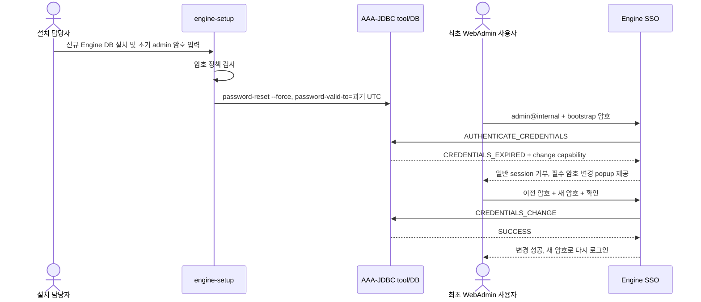

# engine-setup 후 WebAdmin 최초 로그인 암호 변경

## 1. 검토 결론

신규 Engine DB를 생성하는 `engine-setup`에서 입력한 `admin@internal` 암호는 운영용 영구 암호가 아니라 **bootstrap 암호**로 취급한다. setup은 AAA-JDBC에 암호를 저장할 때 유효 종료시각을 과거로 지정한다. 따라서 사용자가 해당 암호로 WebAdmin에 처음 인증하면 AAA는 `CREDENTIALS_EXPIRED`를 반환하고 SSO는 일반 WebAdmin session을 발급하지 않은 채 로그인 화면 위에 닫을 수 없는 암호 변경 popup을 표시한다.

이 통제의 적용범위는 다음과 같다.

| 계정/상황 | 적용 여부 | 이유 |
|---|---|---|
| 신규 DB로 설치한 `admin@internal` | 적용 | setup이 초기 AAA-JDBC 암호를 즉시 만료시킴 |
| 기존 Engine upgrade/reconfiguration | 미적용 | setup 재실행이 기존 관리자 암호를 예고 없이 만료시키지 않도록 함 |
| 외부 LDAP/Kerberos/Keycloak 계정 | 본 구현 범위 밖 | 최초 변경 정책은 외부 identity provider에서 강제해야 함 |
| backup/restore로 복구한 기존 DB | 신규설치 통제로 간주하지 않음 | 기존 credential 상태와 조직의 복구절차를 유지 |
| built-in `InternalAuthn` static verifier | 미적용 | 해당 구현은 `CREDENTIALS_CHANGE` capability를 제공하지 않음 |

## 2. 소스 처리 흐름

### 2.1 setup 단계

`aaa.py`는 신규 DB 설치에서만 초기 관리자 암호를 입력받고 최소 길이, 문자조합, 계정명·취약단어·연속·반복문자 제한을 검사한다. `aaajdbc.py`는 신규 DB이면 현재 UTC보다 하루 전을 `--password-valid-to`로 넘긴다. 하루 전을 사용하는 이유는 Engine과 DB/Host 사이의 작은 시각 오차가 있어도 최초 인증에서 확실히 만료되도록 하기 위해서다.

upgrade 또는 reconfiguration 경로에서는 기존 동작대로 긴 유효기간을 사용한다. 신규 DB 조건을 두지 않고 모든 `engine-setup` 실행에서 암호를 만료시키면 정기 재설정이나 upgrade 후 운영 관리자 계정이 예고 없이 잠길 수 있기 때문이다.

### 2.2 로그인 및 변경 단계

AAA-JDBC가 `CREDENTIALS_EXPIRED`를 반환하면 `AuthnMessageMapper`는 해당 profile이 암호 변경 URL 또는 `CREDENTIALS_CHANGE` capability를 제공하는지 확인한다. 지원하면 `login.jsp`는 별도 link를 클릭하게 하지 않고 닫기 button이 없는 modal popup을 즉시 표시한다. popup은 이전 암호, 새 암호와 새 암호 확인을 받아 기존 `/interactive-change-passwd` endpoint로 제출한다. 변경 요청은 `AuthenticationService.changePassword()`가 이전 credential과 새 credential을 AAA extension의 `CREDENTIALS_CHANGE` command로 전달한다.

암호 변경이 성공하기 전에는 WebAdmin의 일반 관리 session을 발급한 것으로 판정해서는 안 된다. 성공 후 bootstrap 암호 재사용이 거부되고 새 암호로만 로그인되는지 현장시험으로 확인한다.

## 3. 구현 방식 선택 검토

| 방식 | 판정 | 설명 |
|---|---|---|
| 초기 AAA-JDBC 암호 만료 + SSO login modal popup | **채택** | 일반 session 전에 강제하고 popup을 닫거나 dashboard로 진행할 수 없음 |
| 인증 성공 후 WebAdmin 내부 popup으로 변경 권고 | 부적합 | WebAdmin session이 이미 발급되어 popup 우회·닫기 가능 |
| setup에서 임의 암호 생성 후 운영자가 CLI로 변경 | 보완수단 | 사람의 후속조치 누락 가능; 대화형 최초 로그인 요구를 직접 강제하지 않음 |
| 모든 engine-setup 실행 후 암호 만료 | 부적합 | upgrade/reconfiguration이 기존 운영계정을 예고 없이 중단시킴 |
| 별도 Engine DB flag만 두고 UI에서 검사 | 비권고 | AAA와 상태가 이중화되고 REST/SSO 등 다른 로그인 경로의 우회 위험 증가 |

## 4. 설치 및 운영 절차

1. 신규 설치 전 NTP/chrony가 정상인지 확인한다.
2. `engine-setup`에서 임시 전달용 bootstrap 암호를 정책에 맞게 입력한다.
3. setup log에 “initial internal administrator password … require a change at first login” 메시지가 있는지 확인한다. 암호값 자체는 log에 없어야 한다.
4. 지정된 최초 관리자가 HTTPS WebAdmin에 접속한다.
5. bootstrap 암호 입력 후 dashboard가 아니라 로그인 화면 위에 닫기 button 없는 암호 변경 popup이 표시되는지 확인한다.
6. popup에서 이전 암호와 새 암호를 입력하고 변경을 완료한다.
7. bootstrap 암호 로그인 실패, 새 암호 로그인 성공을 확인한다.
8. SSO/AAA 감사기록, UTC 시각, 수행자, 설치 ticket와 시험결과를 보관한다. 암호, cookie와 token 원문은 증적에서 제외한다.
9. bootstrap 암호를 전달한 vault/봉투/ticket의 임시 secret을 즉시 폐기한다.

## 5. 정상·부정 시험표

| ID | 시험 | 기대결과 |
|---|---|---|
| FLPC-01 | 신규 DB engine-setup 완료 후 bootstrap 암호로 WebAdmin 로그인 | 일반 dashboard 진입 전 필수 암호 변경 popup 표시 |
| FLPC-02 | popup을 닫거나 WebAdmin URL을 직접 호출 | 닫기 수단과 인증된 관리 session 없음, 다시 로그인/변경 요구 |
| FLPC-03 | 이전 암호를 틀리게 입력하고 변경 시도 | 변경 실패, 기존 credential 상태 유지 |
| FLPC-04 | 정책 미충족 새 암호 입력 | AAA 정책 오류, 변경 실패 |
| FLPC-05 | 정상 새 암호로 변경 | 변경 성공 후 재로그인 안내 |
| FLPC-06 | bootstrap 암호 재사용 | 로그인 거부 |
| FLPC-07 | 새 암호 사용 | 로그인 성공 및 새 session 발급 |
| FLPC-08 | engine-setup upgrade/reconfiguration | 기존 암호가 이 기능 때문에 강제 만료되지 않음 |
| FLPC-09 | REST API에 bootstrap 암호 사용 | token 미발급; WebAdmin UI만 우회해 session을 얻을 수 없음 |

추가로 새 암호에 bootstrap 암호와 동일한 값을 입력하는 시험을 수행한다. AAA-JDBC의 password history/policy가 동일값을 거부하는지 확인하고, 거부하지 않는 extension version이면 “암호 변경 command 수행”만 충족할 뿐 “서로 다른 신규 암호”를 보장하지 못하므로 provider 정책 보완 전에는 부분 적합으로 판정한다.

## 6. 장애 및 비상복구

* 변경화면이 제공되지 않으면 profile이 AAA-JDBC인지, `CREDENTIALS_CHANGE` capability가 로드됐는지, SSO log의 `CREDENTIALS_EXPIRED` mapping을 확인한다.
* 최초 암호를 분실했거나 변경이 실패한 경우 WebAdmin session 우회를 허용하지 않는다. console에서 승인된 `ovirt-aaa-jdbc-tool user password-reset` 절차로 새 bootstrap 암호를 발급하고 짧은 유효기간/즉시 변경 정책을 다시 적용한다.
* 비상 reset에는 요청자, 승인자, 대상 계정, 수행 Host, UTC 시각과 reset 사유를 남기고 secret 값은 기록하지 않는다.
* 외부 identity provider 장애를 내부 계정 정책 변경으로 임시 우회하지 않는다. break-glass 계정은 별도 승인·봉인·정기시험 정책을 적용한다.

## 7. 제한사항과 후속 보완

1. 현재 setup 변경은 신규 AAA-JDBC 관리자에 한정된다. Keycloak/LDAP 등은 provider 측 “다음 로그인 시 암호 변경” flag를 별도 구성해야 한다.
2. 저장소에는 AAA-JDBC extension 구현 자체가 포함되어 있지 않으므로 만료 판정과 새 암호 유효기간 부여는 설치된 extension version과 통합시험해야 한다.
3. SSO의 암호 변경 성공 log만으로 변경 주체·원본 IP·정책결과가 완전한 감사 event로 남는다고 가정하지 않는다. 실제 audit DB/SIEM 기록을 확인한다.
4. system clock이 크게 어긋나면 만료·token 판정이 달라질 수 있으므로 시간동기화를 설치 선행조건과 증적에 포함한다.
5. setup answer file이나 automation에서 bootstrap 암호를 제공하는 경우 process argument, environment dump, CI log에 노출되지 않도록 secret injection 방식을 검토한다.

## 8. 소스 추적성

| 기능 | 소스 |
|---|---|
| 신규 DB 관리자 암호 입력·복잡도 검사 | `packaging/setup/plugins/ovirt-engine-setup/ovirt-engine/config/aaa.py` |
| AAA-JDBC 사용자 생성·초기 암호 만료 설정 | `packaging/setup/plugins/ovirt-engine-setup/ovirt-engine/config/aaajdbc.py` |
| 만료 결과와 암호 변경 URL/message mapping | `backend/manager/modules/enginesso/src/main/java/org/ovirt/engine/core/sso/service/AuthnMessageMapper.java` |
| credential 변경 command 전달 | `backend/manager/modules/enginesso/src/main/java/org/ovirt/engine/core/sso/service/AuthenticationService.java` |
| 로그인 화면의 필수 암호 변경 modal popup | `backend/manager/modules/enginesso/src/main/webapp/WEB-INF/login.jsp` |
| 암호 변경 화면 | `backend/manager/modules/enginesso/src/main/webapp/WEB-INF/credentialsChange.jsp` |
| 암호 변경 servlet | `backend/manager/modules/enginesso/src/main/java/org/ovirt/engine/core/sso/servlets/InteractiveChangePasswdServlet.java` |
