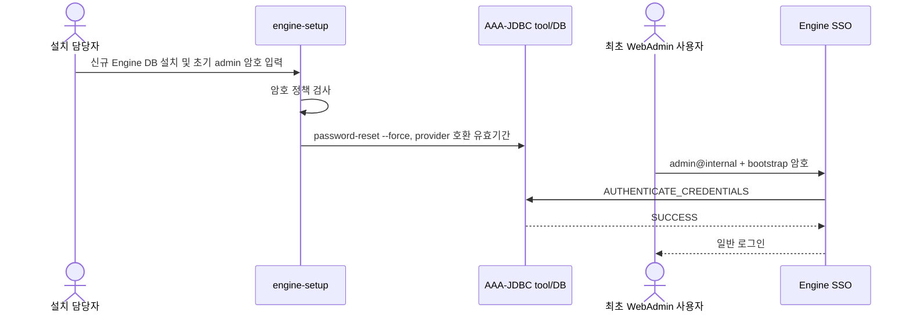

# engine-setup 후 WebAdmin 최초 로그인 암호 변경

## 1. 검토 결론

신규 Engine DB에서 AAA-JDBC 암호의 유효 종료시각을 생성시각보다 과거로 지정하는 방식은 적용하지
않는다. 실제 4.5 공급자에서 해당 credential을 인증할 때 `CREDENTIALS_EXPIRED`가 아니라
`Base.InvokeResult.FAILED`와 내부 `Unexpected Exception`이 반환되어 신규 관리자가 로그인할 수 없기
때문이다. 최초 로그인 강제 변경은 공급자가 지원하는 별도 상태 또는 Engine의 영속 bootstrap 상태가
구현되기 전까지 **미구현**이며, 과거 시각을 주입하는 방식으로 충족했다고 판정해서는 안 된다.

이 통제의 적용범위는 다음과 같다.

| 계정/상황 | 적용 여부 | 이유 |
|---|---|---|
| 신규 DB로 설치한 `admin@internal` | 미적용 | 과거 유효 종료시각이 AAA-JDBC 인증 예외를 유발하므로 호환 가능한 기존 유효기간을 유지 |
| 기존 Engine upgrade/reconfiguration | 미적용 | setup 재실행이 기존 관리자 암호를 예고 없이 만료시키지 않도록 함 |
| 외부 LDAP/Kerberos/Keycloak 계정 | 본 구현 범위 밖 | 최초 변경 정책은 외부 identity provider에서 강제해야 함 |
| backup/restore로 복구한 기존 DB | 신규설치 통제로 간주하지 않음 | 기존 credential 상태와 조직의 복구절차를 유지 |
| built-in `InternalAuthn` static verifier | 미적용 | 해당 구현은 `CREDENTIALS_CHANGE` capability를 제공하지 않음 |

### 1.1 요청된 패스워드 보안 정책 적용 여부

최초 로그인에서 수행되는 **새 패스워드 변경** 경로를 기준으로 검토한 결과는 다음과 같다.

| 요구사항 | 판정 | 현재 구현 |
|---|---|---|
| 최소 12자리 | 적용 | 최초 변경 기본값은 12이며 `ENGINE_SSO_PASSWORD_MIN_LENGTH`로 강화 가능 |
| 대문자·소문자·숫자·특수문자 | 적용 | 최초 변경에서 기본적으로 모두 검사하며 문자 유형별 설정 제공 |
| 사용자 ID와 동일한 패스워드 금지(대소문자 무시) | 적용 | 최초 변경에서 ID 전체와의 동일 여부만 대소문자 없이 검사 |
| 특수문자 포함 선택 설정 | 적용 | `ENGINE_SSO_PASSWORD_REQUIRE_SPECIAL`, 기본값 `true` |
| 동일 문자·패턴 반복 금지 선택 설정 | 적용 | `ENGINE_SSO_PASSWORD_REJECT_REPEATED`, 기본값 `true` |
| 연속된 4자리 입력 금지 선택 설정 | 적용 | `ENGINE_SSO_PASSWORD_REJECT_SEQUENTIAL`, 기본값 `true`; 알파벳·숫자 및 qwerty 키보드 행 검사 |
| 직전 패스워드 재사용 금지 선택 설정 | 적용 | `ENGINE_SSO_PASSWORD_REJECT_PREVIOUS`, 기본값 `true` |
| 3개월 내 패스워드 재사용 금지 선택 설정 | 미구현 | 엔진은 timestamp가 있는 패스워드 이력을 저장하거나 3개월 범위를 계산하지 않음 |

대문자, 소문자 및 숫자 검사는 각각 `ENGINE_SSO_PASSWORD_REQUIRE_UPPERCASE`,
`ENGINE_SSO_PASSWORD_REQUIRE_LOWERCASE`, `ENGINE_SSO_PASSWORD_REQUIRE_DIGIT`로 조정한다. boolean 설정은
명시하지 않으면 안전한 기본값인 `true`가 적용된다. 배포 기본값은
`packaging/services/ovirt-engine/ovirt-engine.conf.in`에도 명시되어 있으므로 운영자는 engine 설정 drop-in에서
각 항목을 독립적으로 덮어쓴 뒤 서비스를 재시작할 수 있다. 최소 길이는 12 미만으로 낮출 수 없다.
3개월 이력 정책은 AAA 공급자 또는 별도 timestamp
기반 이력 구현이 필요하므로 요청된 정책 전체를 **적용 완료**로 판정해서는 안 된다.

## 2. 소스 처리 흐름

### 2.1 setup 단계

`aaa.py`는 신규 DB 설치에서만 초기 관리자 암호를 입력받고 최소 길이, 문자조합, 계정명 포함,
취약단어, 알파벳·숫자 3자리 연속 및 동일 문자 3회 반복을 고정 규칙으로 검사한다. 이 규칙들은 현재
개별 설정으로 활성화하거나 비활성화할 수 없다. `aaajdbc.py`는 신규 설치와 upgrade/reconfiguration 모두
provider 호환성을 위해 기존의 긴 유효기간을 사용한다. 과거 `--password-valid-to`로 만든 credential은
일부 AAA-JDBC 4.5 구현에서 정상적인 만료 결과가 아니라 인증 처리 예외가 되므로 사용하지 않는다.

### 2.2 로그인 및 변경 단계

AAA-JDBC가 `CREDENTIALS_EXPIRED`를 반환하면 `AuthnMessageMapper`는 해당 profile이 암호 변경 URL 또는
`CREDENTIALS_CHANGE` capability를 제공하는지 확인한다. 지원하면 `login.jsp`는 별도 link를 클릭하게
하지 않고 닫기 button이 없는 modal popup을 즉시 표시한다. popup은 이전 암호, 새 암호와 새 암호 확인을
받아 기존 `/interactive-change-passwd` endpoint로 제출한다. 변경 요청은
`AuthenticationService.changePassword()`가 새 패스워드 정책을 먼저 검사하고, 통과한 이전 credential과
새 credential을 AAA extension의 `CREDENTIALS_CHANGE` command로 전달한다. 공급자는 엔진 검사에 더해
자체 정책을 추가로 적용할 수 있다.

암호 변경이 성공하기 전에는 WebAdmin의 일반 관리 session을 발급한 것으로 판정해서는 안 된다. 성공 후 bootstrap 암호 재사용이 거부되고 새 암호로만 로그인되는지 현장시험으로 확인한다.

## 3. 구현 방식 선택 검토

| 방식 | 판정 | 설명 |
|---|---|---|
| 과거 유효 종료시각을 이용한 초기 AAA-JDBC 암호 만료 | **부적합** | AAA-JDBC 4.5에서 `Unexpected Exception`과 로그인 불가를 유발할 수 있음 |
| 인증 성공 후 WebAdmin 내부 popup으로 변경 권고 | 부적합 | WebAdmin session이 이미 발급되어 popup 우회·닫기 가능 |
| setup에서 임의 암호 생성 후 운영자가 CLI로 변경 | 보완수단 | 사람의 후속조치 누락 가능; 대화형 최초 로그인 요구를 직접 강제하지 않음 |
| 모든 engine-setup 실행 후 암호 만료 | 부적합 | upgrade/reconfiguration이 기존 운영계정을 예고 없이 중단시킴 |
| 별도 Engine DB flag만 두고 UI에서 검사 | 비권고 | AAA와 상태가 이중화되고 REST/SSO 등 다른 로그인 경로의 우회 위험 증가 |

## 4. 설치 및 운영 절차

1. 신규 설치 전 NTP/chrony가 정상인지 확인한다.
2. `engine-setup`에서 정책을 충족하는 관리자 암호를 입력한다.
3. setup이 과거 `--password-valid-to`를 설정하지 않았는지 확인한다.
4. `admin@internal`로 WebAdmin 최초 로그인이 성공하는지 확인한다.
5. 최초 로그인 강제 변경이 필요한 환경은 AAA 공급자가 공식 지원하는 기능을 별도로 구성하고 통합시험한다.
6. 공급자 지원 없이 credential DB의 유효시각을 직접 변경하지 않는다.

## 5. 정상·부정 시험표

| ID | 시험 | 기대결과 |
|---|---|---|
| FLPC-01 | 신규 DB engine-setup 완료 후 `admin@internal` 로그인 | AAA 내부 예외 없이 로그인 성공 |
| FLPC-02 | 생성된 초기 credential의 유효 종료시각 확인 | 생성시각보다 과거가 아님 |
| FLPC-03 | 정상적으로 만료된 기존 credential로 로그인 | 공급자가 지원하는 경우 `CREDENTIALS_EXPIRED` 반환 |
| FLPC-04 | 정책 미충족 새 암호로 변경 | SSO/AAA 정책 오류, 변경 실패 |
| FLPC-05 | 정상 새 암호로 변경 | 변경 성공 후 새 암호 로그인 성공 |
| FLPC-06 | upgrade/reconfiguration | 기존 암호가 임의로 만료되지 않음 |

최초 로그인 강제 변경은 현재 미구현이므로 FLPC-01 성공을 강제 변경 통제의 적합 증적으로 사용하지 않는다.
공급자 공식 기능을 추가한 뒤 popup 강제성, REST token 미발급, 이전 암호 재사용 거부 시험을 별도로 수행한다.

## 6. 장애 및 비상복구

* 변경화면이 제공되지 않으면 profile이 AAA-JDBC인지, `CREDENTIALS_CHANGE` capability가 로드됐는지, SSO log의 `CREDENTIALS_EXPIRED` mapping을 확인한다.
* 최초 암호를 분실했거나 변경이 실패한 경우 WebAdmin session 우회를 허용하지 않는다. console에서 승인된 `ovirt-aaa-jdbc-tool user password-reset` 절차로 provider 호환 유효기간의 새 암호를 발급한다.
* 비상 reset에는 요청자, 승인자, 대상 계정, 수행 Host, UTC 시각과 reset 사유를 남기고 secret 값은 기록하지 않는다.
* 외부 identity provider 장애를 내부 계정 정책 변경으로 임시 우회하지 않는다. break-glass 계정은 별도 승인·봉인·정기시험 정책을 적용한다.

## 7. 제한사항과 후속 보완

1. 최초 로그인 강제 변경은 현재 구현하지 않는다. Keycloak/LDAP 및 향후 AAA-JDBC 공급자 기능은 provider 측 “다음 로그인 시 암호 변경” flag를 별도 구성해야 한다.
2. 저장소에는 AAA-JDBC extension 구현 자체가 포함되어 있지 않으므로 만료 판정과 새 암호 유효기간 부여는 설치된 extension version과 통합시험해야 한다.
3. SSO의 암호 변경 성공 log만으로 변경 주체·원본 IP·정책결과가 완전한 감사 event로 남는다고 가정하지 않는다. 실제 audit DB/SIEM 기록을 확인한다.
4. system clock이 크게 어긋나면 만료·token 판정이 달라질 수 있으므로 시간동기화를 설치 선행조건과 증적에 포함한다.
5. setup answer file이나 automation에서 bootstrap 암호를 제공하는 경우 process argument, environment dump, CI log에 노출되지 않도록 secret injection 방식을 검토한다.

## 8. 소스 추적성

| 기능 | 소스 |
|---|---|
| 신규 DB 관리자 암호 입력·복잡도 검사 | `packaging/setup/plugins/ovirt-engine-setup/ovirt-engine/config/aaa.py` |
| AAA-JDBC 사용자 생성·초기 암호 만료 설정 | `packaging/setup/plugins/ovirt-engine-setup/ovirt-engine/config/aaajdbc.py` |
| 만료 결과와 암호 변경 URL/message mapping | `backend/manager/modules/enginesso/src/main/java/org/ovirt/engine/core/sso/service/AuthnMessageMapper.java` |
| credential 변경 command 전달 | `backend/manager/modules/enginesso/src/main/java/org/ovirt/engine/core/sso/service/AuthenticationService.java` |
| 로그인 화면의 필수 암호 변경 modal popup | `backend/manager/modules/enginesso/src/main/webapp/WEB-INF/login.jsp` |
| 암호 변경 화면 | `backend/manager/modules/enginesso/src/main/webapp/WEB-INF/credentialsChange.jsp` |
| 암호 변경 servlet | `backend/manager/modules/enginesso/src/main/java/org/ovirt/engine/core/sso/servlets/InteractiveChangePasswdServlet.java` |
