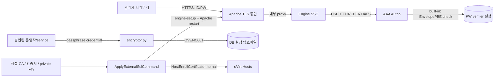
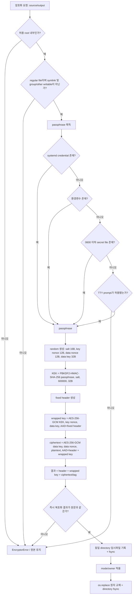
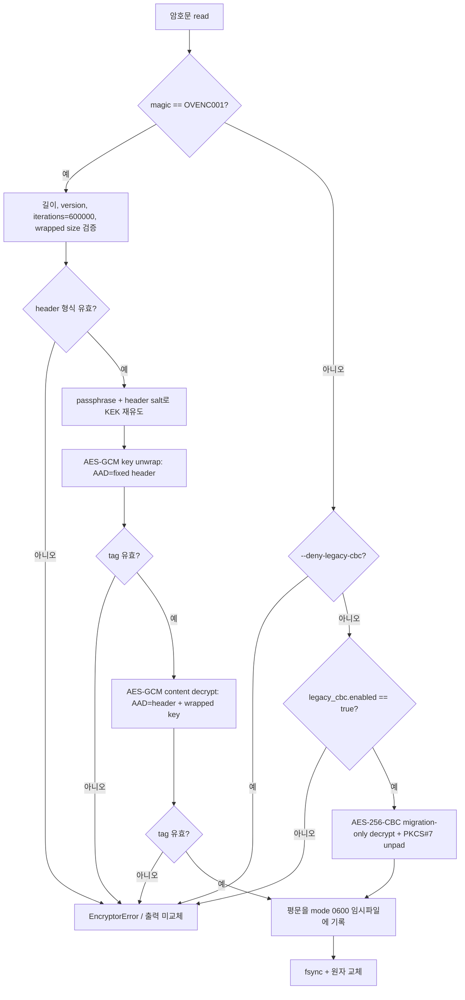
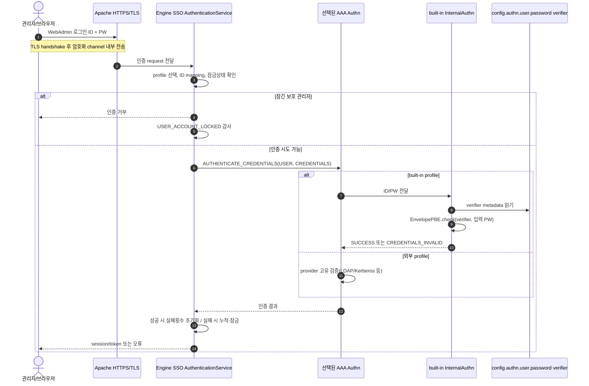
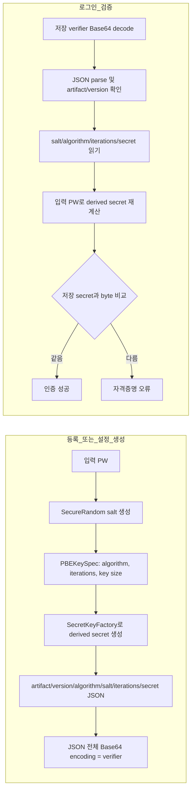
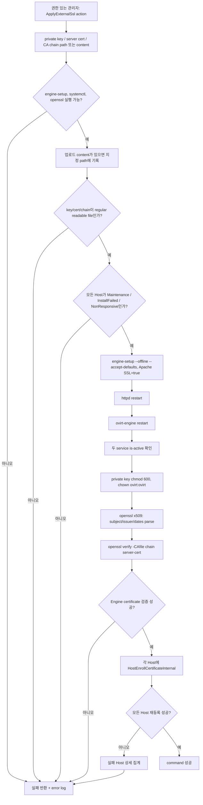
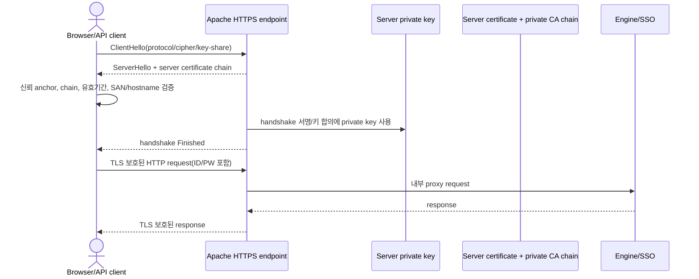

# OV-Works 보안 알고리즘 흐름도

## 1. 문서 목적과 범위

본 문서는 현재 저장소의 구현을 기준으로 다음 보안 처리의 입력, 신뢰경계, 알고리즘, 실패경로 및 운영 확인사항을 흐름도로 정리한다.

1. `encryptor.py`의 DB 설정파일 암호화·복호화
2. WebAdmin ID/PW의 전송 및 built-in 인증 검증
3. 사설 CA 기반 Engine SSL 적용과 Host 인증서 재등록

> **중요:** WebAdmin ID/PW와 DB 설정파일은 서로 다른 보호방식을 사용한다. DB 설정파일은 복호 가능한 AES-256-GCM 암호문으로 저장하지만, built-in 관리자 PW는 `EnvelopePBE` verifier와 입력 PW를 비교하며 저장 PW를 복호화하지 않는다. ID는 인증 주체 식별과 감사에 필요하므로 복호화 대상 암호문으로 저장하는 흐름이 아니다. WebAdmin ID/PW의 전송 기밀성은 배포된 HTTPS/TLS가 담당한다.

## 2. 전체 보안경계



* 브라우저↔Apache 구간의 실제 TLS protocol/cipher, hostname/SAN 검증은 설치 서버에서 확인한다.
* SSO가 선택한 외부 LDAP/Kerberos/AAA의 PW 저장 알고리즘은 해당 provider의 별도 보안명세를 따른다.
* 파일 암호화 passphrase, WebAdmin PW, private key는 log·ticket·화면 capture에 남기지 않는다.

## 3. `encryptor.py` 암호화 흐름

### 3.1 입력과 고정 parameter

| 구분 | 구현값 |
|---|---|
| 출력 format | `OVENC001`, version `1` |
| 내용 암호화 | AES-256-GCM, random 256-bit data key |
| data key wrapping | AES-256-GCM |
| KEK 유도 | PBKDF2-HMAC-SHA-256, 600,000회, random 128-bit salt, 256-bit 출력 |
| nonce | key wrapping용·내용 암호화용 각각 독립 random 96-bit |
| GCM tag | 각 AES-GCM 결과에 128-bit tag 포함 |
| 허용 root | `/etc/ovirt-engine`, `/etc/ovirt-engine-dwh` |
| 일괄 암호화 allowlist | `10-setup-database.conf`, `10-setup-dwh-database.conf` |

### 3.2 암호화 알고리즘



passphrase 조회 순서는 systemd credential, `OVIRT_ENCRYPTOR_PASSPHRASE`, 설정/CLI가 지정한 secret file, 명시적으로 허용된 TTY prompt 순이다. 운영환경에서는 process 환경 노출 위험이 있는 환경변수보다 `LoadCredentialEncrypted`를 우선한다.

### 3.3 `OVENC001` 인증 범위와 binary 배치

```text
+---------------- fixed header ----------------+---------------- wrapped key ----------------+------------ encrypted data ------------+
| magic 8 | ver 1 | iter 4 | salt 16 | KN 12 | DN 12 | WKS 2 | data-key ciphertext 32 + GCM tag 16 | plaintext ciphertext + GCM tag 16 |
+----------------------------------------------+---------------------------------------------+----------------------------------------+
|<---------------- AAD for key wrapping ------>|
|<---------------- AAD for content encryption: fixed header + wrapped key -------------------->|
```

* `KN`은 key nonce, `DN`은 data nonce, `WKS`는 wrapped-key 길이이다.
* header의 format/version/반복횟수/nonce/길이 또는 wrapped key가 변조되면 GCM 인증이 실패한다.
* 동일 passphrase를 사용해도 random salt, nonce와 data key 때문에 매번 다른 결과가 생성된다.

### 3.4 복호화 알고리즘



legacy AES-256-CBC는 인증 tag가 없는 이관 전용 read 경로이다. 신규 암호문을 CBC로 쓰는 경로는 없으며, 이관 완료 후 `--deny-legacy-cbc`를 사용한다.

### 3.5 파일 선택·원자성 통제

`encrypt_conf_files.py`는 허용 root를 symlink를 따라가지 않고 순회하며 allowlist의 두 filename만 처리한다. 이미 `OVENC001`인 파일은 건너뛴다. `internal.properties`는 AAA extension이 직접 읽으므로 이 일괄 암호화 대상이 아니다. 쓰기는 같은 directory의 임시파일에 수행하고 `fsync` 후 `os.replace`하며, 실패 시 임시파일을 삭제한다.

## 4. WebAdmin ID/PW 보호 및 인증 흐름

### 4.1 전송·검증 흐름



### 4.2 built-in PW verifier 생성·검증



`EnvelopePBE` format은 알고리즘, 반복횟수와 key 크기를 caller가 지정해 verifier 안에 저장한다. 따라서 실제 운영 verifier의 algorithm·iterations를 확인하지 않고 특정 PBKDF2 규격을 일괄 선언해서는 안 된다. Base64는 encoding이지 암호화가 아니다. 이 verifier에서는 원래 PW를 복호화하는 함수나 흐름이 없다.

### 4.3 ID와 PW의 보호속성

| 데이터 | 저장/처리 방식 | 복호화 여부 | 필수 운영 확인 |
|---|---|---|---|
| WebAdmin ID | profile mapping, principal 식별 및 감사에 사용 | 해당 없음 | log의 개인정보 접근통제, 입력·출력 encoding |
| 전송 중 PW | HTTPS/TLS channel에서 전달, SSO가 AAA `CREDENTIALS`로 전달 | TLS 종단에서 application 입력으로 사용 | HTTP 우회 차단, TLS protocol/cipher, 인증서 SAN/chain |
| built-in 저장 PW | `EnvelopePBE` verifier | 복호화하지 않음 | 실제 algorithm/iterations, file owner/mode, 민감 key masking |
| 외부 AAA PW | provider가 검증 | provider별 상이 | 외부 AAA 보안명세와 저장·전송 증적 |

`InternalAuthn`은 `config.authn.user.password`를 sensitive configuration key로 등록한다. 다만 sensitive 표시만으로 heap dump, debug capture 또는 잘못 구성된 reverse proxy의 노출을 막는다고 간주하지 않는다.

## 5. 사설 SSL 적용 흐름

### 5.1 적용 및 검증 순서



이 command는 System object action group에 대한 권한검사를 선언한다. 입력 content를 지정 path에 기록한 후 전체 절차를 진행하며, 중간 단계 실패 시 command를 실패로 표시한다. 그러나 이 구현에는 이미 변경된 인증서 파일과 재시작을 이전 상태로 자동 복구하는 transaction/rollback이 없으므로 작업 전 백업과 수동 rollback 계획이 필요하다.

### 5.2 TLS 접속 시 보안 알고리즘의 역할



사설 CA는 server certificate의 신뢰경로를 제공하며 대칭 content-encryption key가 아니다. 실제 handshake algorithm과 protocol은 Apache/OpenSSL의 배포 설정과 client 협상 결과로 결정된다. `ApplyExternalSslCommand`는 certificate parse와 CA chain 검증은 수행하지만 다음을 직접 검증하지 않으므로 현장시험이 필요하다.

* private key와 server certificate public key의 명시적 일치
* SAN/접속 hostname 일치
* 승인 TLS protocol/cipher만 허용되는지 여부
* CRL/OCSP 또는 조직의 인증서 폐기 확인방식
* HTTP→HTTPS redirect와 HTTP 인증정보 제출 차단
* 인증서 만료 사전경보와 rollback 복구

## 6. 실패경로 및 보안속성 요약

| 기능 | 기밀성 | 무결성/인증 | 대표 실패처리 | 남은 운영통제 |
|---|---|---|---|---|
| DB 설정 암호파일 | AES-256-GCM data key | 두 GCM tag와 AAD | tag/format/경로 오류 시 출력 교체 안 함 | passphrase 수명주기, backup·복구, 권한 |
| built-in PW | verifier만 저장 | 동일 parameter로 재유도 후 비교 | invalid credential, 실패 누적·잠금 | 실제 PBE parameter와 외부 AAA 확인 |
| WebAdmin 전송 | 협상된 TLS cipher | server certificate/CA chain, TLS transcript | handshake 또는 인증 실패 | SAN, protocol/cipher, 폐기 확인 |
| 사설 SSL 적용 | private key mode 0600 | `openssl verify -CAfile` | non-zero command 또는 Host 실패 집계 | 사전 backup, rollback, key-cert 일치 |

## 7. 검토·시험 체크리스트

- [ ] `OVENC001` header, PBKDF2 600,000회, 두 독립 nonce와 두 GCM tag를 test vector로 확인했다.
- [ ] header, wrapped key, ciphertext, tag를 각각 1 byte 변조했을 때 복호화 및 영구파일 교체가 실패했다.
- [ ] wrong passphrase와 truncated file이 안전한 오류만 반환하고 평문을 생성하지 않았다.
- [ ] systemd credential을 우선 사용하고 secret file mode가 0600 이하이다.
- [ ] legacy CBC 이관 후 `--deny-legacy-cbc`로 재시험했다.
- [ ] WebAdmin HTTP 인증 경로가 차단되고 packet capture에서 ID/PW가 TLS 밖에 노출되지 않는다.
- [ ] built-in verifier의 algorithm, salt 길이, iterations를 마스킹된 metadata로 확인했다.
- [ ] 외부 AAA 사용 시 해당 provider의 PW 저장·검증 흐름을 별도로 첨부했다.
- [ ] server key/certificate 일치, CA chain, SAN/hostname, 유효기간과 승인 protocol/cipher를 검사했다.
- [ ] SSL 적용 전 backup과 실패 단계별 rollback을 시험했다.
- [ ] 모든 Host 인증서 재등록 성공과 실패 Host 집계 결과를 보존했다.

## 8. 소스 추적성

| 흐름 | 핵심 구현 |
|---|---|
| DB 설정파일 AES-GCM/PBKDF2, legacy CBC, 원자적 쓰기 | `packaging/encryptor/encryptor.py` |
| 일괄 대상 allowlist와 directory 순회 | `packaging/encryptor/encrypt_conf_files.py` |
| SSO credential 전달·잠금 | `backend/manager/modules/enginesso/src/main/java/org/ovirt/engine/core/sso/service/AuthenticationService.java` |
| built-in ID/PW 검증·sensitive key | `backend/manager/modules/builtin-extensions/src/main/java/org/ovirt/engine/extension/aaa/builtin/internal/InternalAuthn.java` |
| verifier encode/check | `backend/manager/modules/uutils/src/main/java/org/ovirt/engine/core/uutils/crypto/EnvelopePBE.java` |
| 사설 SSL 적용·chain 검증·Host 재등록 | `backend/manager/modules/bll/src/main/java/org/ovirt/engine/core/bll/ApplyExternalSslCommand.java` |
| Apache SSL 설정 생성 | `packaging/setup/plugins/ovirt-engine-setup/ovirt-engine-common/apache/ssl.py` |

