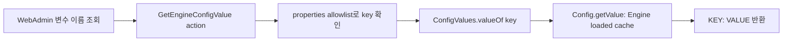

# WebAdmin 변수 이름 조회 시 DB 접속 오류 검토

## 1. 현상과 원인

WebAdmin의 **설정 → 환경변수 설정 → 변수 이름 조회**는 Engine 내부 action을 호출하지만, 기존 backend command는 다시 별도 `engine-config -g <KEY>` process를 실행했다. 이 child process는 실행 중인 Engine의 이미 구성된 DB connection/cache를 재사용하지 않고 자체적으로 DB 설정을 읽어 새 connection을 만든다.

따라서 다음 환경에서는 Engine 서비스와 WebAdmin이 정상이어도 조회만 실패할 수 있다.

* DB 설정파일이 별도 암호화되어 child `engine-config`가 복호화 credential을 받지 못함
* service 전용 environment/systemd credential이 child process에 동일하게 전달되지 않음
* child process가 다른 hostname, port 또는 설정파일을 선택함
* `JAVA_TOOL_OPTIONS` 진단문과 DB connection 오류가 합쳐져 WebAdmin 결과에 그대로 노출됨

화면에 나타난 `Picked up JAVA_TOOL_OPTIONS ... Connection to the Database failed`는 조회한 변수 `UserSessionTimeOutInterval`이 없다는 의미가 아니라 **조회 구현이 불필요한 두 번째 DB connection을 생성하다 실패한 것**으로 판정한다.

## 2. 수정 방식

조회 command에서 외부 `engine-config` process 실행을 제거하고, 실행 중인 Engine이 시작 시 DB에서 적재한 `Config` cache를 사용한다.

이 방식은 다음 효과가 있다.

1. 조회마다 JVM과 DB connection을 새로 만들지 않는다.
2. 현재 Engine이 실제 사용 중인 typed value를 반환한다.
3. `JAVA_TOOL_OPTIONS`와 CLI stderr가 사용자 화면에 섞이지 않는다.
4. 기존 `CONFIGURE_ENGINE` 권한검사와 properties key allowlist를 유지한다.
5. 알 수 없는 `ConfigValues` 이름은 기존과 동일하게 “존재하지 않는 변수”로 실패한다.

## 3. 적용범위와 제한

이번 변경은 **조회(`GetEngineConfigValue`)** 경로에 적용된다. 수정(`SetEngineConfigValue`)은 영구 DB 변경, type/range validation, version 선택과 reload/restart 정책이 필요하므로 기존 `engine-config -s` 경로를 유지한다.

수정 action이 실패했을 때는 자동 재조회를 실행하지 않는다. 실패 직후 runtime 값을 다시 조회해 오류문을 덮어쓰면 사용자가 수정 성공으로 오인할 수 있기 때문이다. 실패 output은 화면에 유지하여 DB credential/connection 또는 validation 문제를 조치할 수 있게 한다.

Engine의 loaded cache는 process가 현재 사용 중인 값이다. CLI로 DB 값을 변경했지만 reload/restart하지 않은 항목은 DB의 새 값과 현재 runtime 값이 다를 수 있다. WebAdmin 화면에는 runtime 조회값이라는 의미를 명확히 표시하고, 수정 후에는 해당 변수의 reload/restart 요구사항에 따라 적용을 확인해야 한다.

DB 자체가 실제로 중단된 경우에도 cache에 이미 적재된 값 조회는 성공할 수 있다. 이는 조회 화면의 가용성을 위한 동작이며 DB health 판정을 대체하지 않는다. DB 상태는 Engine health check와 별도 DB monitoring으로 판단한다.

## 4. 점검 절차

1. WebAdmin에서 `UserSessionTimeOutInterval`을 조회한다.
2. 결과 Key가 `UserSessionTimeOutInterval`, Value가 현재 Engine runtime 값인지 확인한다.
3. 결과에 `Picked up JAVA_TOOL_OPTIONS`나 DB connection 오류가 없는지 확인한다.
4. 존재하지 않는 key를 조회하여 “존재하지 않는 변수”로 처리되는지 확인한다.
5. `CONFIGURE_ENGINE` 권한이 없는 계정의 action 호출이 거부되는지 확인한다.
6. Engine log에서 조회 시 새로운 `engine-config` child process/DB connection 실패가 발생하지 않는지 확인한다.
7. CLI 및 DB 값과 비교할 때는 version과 runtime reload 여부를 함께 기록한다.

## 5. 소스 추적성

| 기능 | 소스 |
|---|---|
| WebAdmin 조회·결과 표시 | `frontend/webadmin/modules/webadmin/src/main/java/org/ovirt/engine/ui/webadmin/section/main/view/popup/configure/EnvironmentVariablesView.java` |
| Engine cache 기반 조회 | `backend/manager/modules/bll/src/main/java/org/ovirt/engine/core/bll/GetEngineConfigValueCommand.java` |
| typed configuration cache API | `backend/manager/modules/common/src/main/java/org/ovirt/engine/core/common/config/Config.java`, `ConfigValues.java` |
| 조회 단위시험 | `backend/manager/modules/bll/src/test/java/org/ovirt/engine/core/bll/GetEngineConfigValueCommandTest.java` |

## 6. 암호화된 DB 설정과 `engine-config` CLI

`10-setup-database.conf`가 `OVENC001` 형식으로 암호화된 경우 Java 설정 로더는 해당 파일을 직접 읽지 않는다.
이전 `engine-config` 실행 스크립트는 암호화 파일을 제외한 기본 설정으로 DB 연결을 시도할 수 있었고, 그 결과
PostgreSQL `SQLState 28P01`(password authentication failed)이 발생했다.

수정된 실행 스크립트는 다음 순서로 동작한다.

1. `${ENGINE_VARS}`와 `${ENGINE_VARS}.d/*.conf`에서 `OVENC001` 파일을 확인한다.
2. 기존 oVirt encryptor와 설정된 credential을 이용해 mode `0600` 임시 파일로 복호화한다.
3. 평문 설정과 복호화된 설정을 설치 시 적용되는 순서대로 하나의 임시 runtime 설정으로 병합한다.
4. 임시 설정 경로를 `ovirt-engine.config.vars` JVM property로 전달한다.
5. 명령 종료 또는 signal 수신 시 모든 임시 파일을 삭제한다.

암호화 원본 파일을 평문으로 다시 저장하지 않으며, credential이 없거나 복호화 인증에 실패하면 DB에 잘못된
암호로 접속하지 않고 명시적인 복호화 오류로 중단한다.
